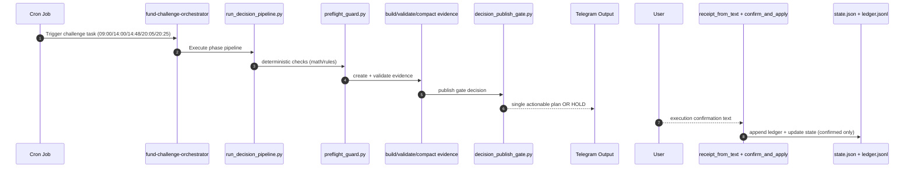
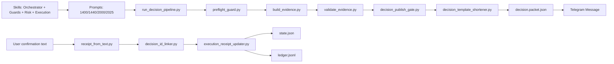

# OpenClaw Fund Real-Time Trading Challenge

Production-minded, challenge-only workflow for a **1000 CNY aggressive off-exchange fund trading experiment**.

## Goal

- Start capital: **1000 CNY**
- Target: **2x within 6 months**
- Platforms: **Alipay / TiantianFund**
- Strategy: **short-term aggressive**, but strictly evidence-gated and risk-controlled

---

## Branch scope

This branch intentionally contains only challenge-relevant assets:

- `fund_challenge/` runtime pipeline, state, prompts, scripts
- `skills/fund-challenge-*` specialized skills used by challenge jobs
- Minimal docs for operations and onboarding

No unrelated engineering/business code is included.

---

## System architecture

1. **State-first**: updates are deterministic and ledger-backed
2. **Evidence-gated**: no EXECUTE_READY without validation and publish gate
3. **Execution-safe**: T+ timing, cutoff, and feasibility constraints are enforced
4. **Low-token operation**: compact outputs, source minification, evidence compaction
5. **Single-plan policy**: normal messages carry one actionable plan only

---

## Trading-day schedule

- **09:00** Healthcheck (silent when healthy)
- **13:35** Universe refresh (broad scan + deep refine)
- **14:00** PLAN_ONLY generation
- **14:48** EXECUTE_READY gate (single plan)
- **21:00** Update (STEP1, lightweight)
- **21:30** PostSummary (STEP2)
- **21:45** Review
- **22:00** Maintenance (cache prune)

---

## Daily upgrade logs

- 2026-03-10:
  - 涓枃锛歚docs/upgrades/2026-03-10/upgrade-log.zh-CN.md`
  - English: `docs/upgrades/2026-03-10/upgrade-log.en.md`

## Human responsibilities

You only need to do manual execution when instructed:

- If BUY is issued, execute in app before cutoff
- Confirm with short text, e.g.:
  - `I bought 020899 100 CNY at 14:52`
  - `Not executed: subscription suspended`

Everything else (state, ledger, consistency checks) is automated by scripts.

---

## File-by-file guide

## 1) `fund_challenge/` root files

- `state.json`
  - Current authoritative portfolio state snapshot.
  - Updated only after explicit user confirmation.

- `ledger.jsonl`
  - Immutable event stream (append-only).
  - Every confirmed execution must create an event.

- `instrument_rules.json`
  - Effective per-fund/per-platform execution constraints (T+, cutoff, status).

- `instrument_rule_sources.json`
  - Source mapping for refreshing rule metadata (preferred/fallback URLs).

- `receipt.template.json`
  - Canonical template for execution confirmation receipt.

- `decision_history.jsonl` (created at runtime)
  - Decision fingerprint history used by duplicate-decision guard.

---

## 2) `fund_challenge/prompts/`

- `healthcheck.md`
  - Lightweight health probe instructions.

- `plan.md`
  - PLAN_ONLY phase instructions.

- `1420-track.md`
  - Mid-session tracking logic (kept lightweight).

- `execute-gate.md`
  - Final execution gate logic (EXECUTE_READY path).

- `2000-update.md`
  - End-of-day update protocol.

- `review.md`
  - Concise review output policy.

---

## 3) `fund_challenge/evidence/`

- `template.json`
  - Evidence schema baseline.

- `latest.json` (runtime)
  - Latest generated evidence artifact.

- `latest.compact.json` (runtime)
  - Token-optimized evidence version for publish/reasoning.

- `README.md`
  - Evidence artifact contract.

---

## 4) `fund_challenge/scripts/` (key purpose by script)

### Orchestration / pipeline
- `run_decision_pipeline.py`
  - End-to-end compact decision pipeline.
- `daily_bundle_runner.py`
  - Lightweight preflight+status bundle.
- `preflight_guard.py`
  - Deterministic pre-check chain; compact mode support.

### Math / state integrity
- `state_math.py`
  - Deterministic portfolio arithmetic.
- `execution_receipt_updater.py`
  - Applies confirmed execution into state + ledger.
- `confirm_and_apply.py`
  - One-shot parse+link+apply workflow.

### Evidence and publish gates
- `build_evidence.py`
  - Builds evidence artifact from template + state digest.
- `validate_evidence.py`
  - Required field and phase validation gate.
- `decision_publish_gate.py`
  - Blocks executable instruction when evidence is insufficient.
- `evidence_compactor.py`
  - Slims evidence JSON for low-token operation.
- `decision_packet_builder.py`
  - Builds compact decision packet for downstream publish.

### Confirmation parsing / linking
- `receipt_from_text.py`
  - Parses natural language execution confirmation into receipt JSON.
- `decision_id_linker.py`
  - Links receipt to latest decision ID.

### Token and runtime efficiency
- `source_fetch_minifier.py`
  - Extracts high-signal lines from long fetched text.
- `runtime_cache.py`
  - TTL cache for repeated source/transform outputs.
- `cache_key_builder.py`
  - Stable cache-key helper.
- `status_brief.py`
  - Ultra-short daily portfolio status line.
- `decision_template_shortener.py`
  - Converts decision payload to concise publish line.
- `decision_delta_guard.py`
  - Prevents same-day duplicate instruction publishing.
- `fast_fail_report.py`
  - Produces one-line fail alert (HOLD-safe).
- `refresh_instrument_rules.py`
  - Refreshes rule metadata using source map.

---

## 5) `skills/fund-challenge-*`

Each skill focuses on one concern (orchestration, guardrails, execution, rules, postmortem).
They are challenge-scoped and not intended for general wealth-management chat.

---

## How scripts and skills work together (sequence)

## Component flow (skills -> scripts -> artifacts)

## Cron policy

Current jobs are split for stability and low timeout risk:

- 09:00 Healthcheck
- 14:00 Plan
- 14:48 Execute gate
- 20:05 Update
- 20:25 Review
- 21:00 Maintenance

Recommended runtime params: isolated session, low/minimal thinking, exact schedule, light context, best-effort delivery.

---

## Safety policy

If any key number/source cannot be verified, enforce:

`DECISION_ABORTED_UNVERIFIED_DATA`

and fall back to **HOLD**.

