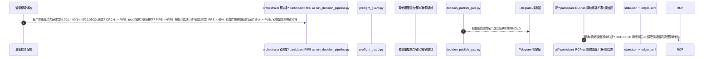
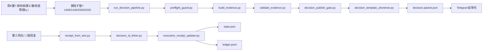

# OpenClaw 鍩洪噾瀹炵洏鎸戞垬鍒嗘敮

杩欐槸涓€涓潰鍚?*1000 鍏冨満澶栧熀閲戠煭绾挎縺杩涙寫鎴?*鐨勪笓鐢ㄥ垎鏀紝寮鸿皟绋冲畾鎵ц銆佸彲杩芥函銆佷綆 token 寮€閿€銆?
## 鐩爣

- 鍒濆璧勯噾锛?*1000 鍏?*
- 鐩爣锛?*6 涓湀缈诲€?*
- 骞冲彴锛?*鏀粯瀹?/ 澶╁ぉ鍩洪噾**
- 椋庢牸锛?*鐭嚎婵€杩?*锛堜絾蹇呴』閫氳繃璇佹嵁涓庨鎺ч棬锛?
---

## 鍒嗘敮鑼冨洿

鏈垎鏀彧淇濈暀鎸戞垬鐩稿叧鍐呭锛?
- `fund_challenge/`锛氭寫鎴樿繍琛屾枃浠躲€佺姸鎬併€佽剼鏈€佹彁绀鸿瘝
- `skills/fund-challenge-*`锛氭寫鎴樹笓鐢ㄦ妧鑳?- 蹇呰鐨勮鏄庢枃妗?
涓嶅寘鍚笌鏈寫鎴樻棤鍏崇殑宸ョ▼浠ｇ爜銆?
---

## 璁捐鍘熷垯

1. **鐘舵€佷紭鍏?*锛氱姸鎬佹洿鏂板繀椤诲彲杩芥函銆佸彲澶嶆牳
2. **璇佹嵁闂ㄦ帶**锛氭湭閫氳繃璇佹嵁鏍￠獙锛屼笉鍏佽杩涘叆 EXECUTE_READY
3. **鎵ц鍙鎬?*锛氫弗鏍兼墽琛?T+銆佹埅姝㈡椂闂淬€佺敵璧庡彲琛屾€ц鍒?4. **浣?token**锛氬帇缂╄緭鍑恒€佸帇缂╄瘉鎹€佺煭鏍煎紡鍙戝竷
5. **鍗曟柟妗堢瓥鐣?*锛氶粯璁ゆ瘡娆″彧缁欎竴涓彲鎵ц鏂规

---

## 姣忔棩娴佺▼锛堜氦鏄撴棩锛?
- **09:00** 鍋ュ悍妫€鏌ワ紙姝ｅ父闈欓粯锛屽紓甯哥煭鍛婅锛?- **13:35** 鎵╂睜鍒锋柊锛堢矖绛?绮剧瓫锛?- **14:00** PLAN_ONLY
- **14:48** EXECUTE_READY 鏈€缁堥棬鎺э紙鍗曟柟妗堬級
- **21:00** 鏃ョ粓鏇存柊锛圫TEP1 杞婚噺锛?- **21:30** PostSummary锛圫TEP2锛?- **21:45** 杞婚噺澶嶇洏
- **22:00** 缁存姢浠诲姟锛堢紦瀛樻竻鐞嗭級

---

## 姣忔棩鍗囩骇鏃ュ織

- 2026-03-10锛?  - 涓枃锛歚docs/upgrades/2026-03-10/upgrade-log.zh-CN.md`
  - English锛歚docs/upgrades/2026-03-10/upgrade-log.en.md`

## 浣犻渶瑕佸仛鐨勪簨

浣犲彧闇€瑕佸湪鏀跺埌 BUY 鎸囦护鍚庢墜鍔ㄤ笅鍗曪紝骞跺洖澶嶇‘璁わ細

- `鎴戝凡涔板叆 020899 100鍏冿紝14:52`
- `鏈墽琛岋細闄愯喘/鏆傚仠鐢宠喘`

鐘舵€佸洖鍐欎笌娴佹按璁板綍鐢辫剼鏈嚜鍔ㄥ鐞嗐€?
---

## 鏂囦欢璇存槑锛堟寜鐩綍锛?
## 1锛塦fund_challenge/` 鏍圭洰褰?
- `state.json`
  - 褰撳墠鎸佷粨涓庤祫閲戠殑鏉冨▉鐘舵€佸揩鐓с€?  - 浠呭湪浣犳槑纭‘璁ゆ墽琛屽悗鏇存柊銆?
- `ledger.jsonl`
  - 浜嬩欢娴佹按锛堝彧杩藉姞锛屼笉鍥炲啓鍘嗗彶锛夈€?
- `instrument_rules.json`
  - 鐢熸晥涓殑鍩洪噾/骞冲彴鎵ц绾︽潫锛圱+銆佹埅姝€佺姸鎬佺瓑锛夈€?
- `instrument_rule_sources.json`
  - 瑙勫垯鏉ユ簮鏄犲皠锛堜紭鍏堟潵婧愪笌澶囩敤鏉ユ簮锛夈€?
- `receipt.template.json`
  - 鎵ц纭鍥炴墽妯℃澘銆?
- `decision_history.jsonl`锛堣繍琛屾椂鐢熸垚锛?  - 鍚屾棩閲嶅鍐崇瓥鍘婚噸璁板綍銆?
---

## 2锛塦fund_challenge/prompts/`

- `healthcheck.md`锛氬仴搴锋鏌ヨ鏄?- `plan.md`锛?4:00 棰勬璇存槑
- `1420-track.md`锛氱洏涓窡韪紙杞婚噺锛?- `execute-gate.md`锛氬熬鐩樻渶缁堥棬鎺ц鏄?- `2000-update.md`锛氭敹鐩樻洿鏂拌鏄?- `review.md`锛氳交閲忓鐩樿鏄?
---

## 3锛塦fund_challenge/evidence/`

- `template.json`锛氳瘉鎹ā鏉?- `latest.json`锛堣繍琛屾椂锛夛細鏈€鏂拌瘉鎹?- `latest.compact.json`锛堣繍琛屾椂锛夛細鍘嬬缉璇佹嵁锛堢渷 token锛?- `README.md`锛氳瘉鎹瓧娈佃鑼?
---

## 4锛塦fund_challenge/scripts/`锛堟寜鍔熻兘锛?
### 绠＄嚎涓庤皟搴?- `run_decision_pipeline.py`锛氱鍒扮浣?token 鍐崇瓥娴佹按绾?- `daily_bundle_runner.py`锛氶妫€+鐘舵€佺畝鎶ョ殑涓€閿交閲忔祦绋?- `preflight_guard.py`锛氶妫€鎬婚椄锛堟敮鎸?compact锛?
### 鐘舵€佷笌璁＄畻
- `state_math.py`锛氳祫閲?鐩堜簭纭畾鎬ц绠?- `execution_receipt_updater.py`锛氭寜纭鍥炴墽鏇存柊 state+ledger
- `confirm_and_apply.py`锛氭枃鏈‘璁ゅ埌鍥炲啓鐨勪竴閿祦绋?
### 璇佹嵁涓庡彂甯冮棬鎺?- `build_evidence.py`锛氱敓鎴愯瘉鎹枃浠?- `validate_evidence.py`锛氳瘉鎹瓧娈典笌闃舵鏍￠獙
- `decision_publish_gate.py`锛氭棤鍏呭垎璇佹嵁绂佹鍙戝竷鎵ц鎸囦护
- `evidence_compactor.py`锛氳瘉鎹槮韬?- `decision_packet_builder.py`锛氭墦鍖呭彂甯冪敤鍐崇瓥鍖?
### 鎵ц纭瑙ｆ瀽
- `receipt_from_text.py`锛氭妸鑷劧璇█纭杞垚鍥炴墽 JSON
- `decision_id_linker.py`锛氬洖鎵х粦瀹?decisionId

### 浣?token / 楂樻晥鐜囧伐鍏?- `source_fetch_minifier.py`锛氶暱鏂囨湰鏉ユ簮鍘嬬缉
- `runtime_cache.py`锛歍TL 杩愯缂撳瓨
- `cache_key_builder.py`锛氱ǔ瀹氱紦瀛橀敭
- `status_brief.py`锛氳秴鐭姸鎬佽
- `decision_template_shortener.py`锛氬喅绛栨枃妗堢煭鏍煎紡鍖?- `decision_delta_guard.py`锛氬悓鏃ラ噸澶嶅喅绛栭槻鎶?- `fast_fail_report.py`锛氬け璐ョ煭鍛婅锛堥粯璁?HOLD锛?- `refresh_instrument_rules.py`锛氳鍒欏厓鏁版嵁鍒锋柊

---

## 5锛塦skills/fund-challenge-*`

杩欎簺鎶€鑳芥寜鑱岃矗鎷嗗垎锛堢紪鎺掋€佹牎楠屻€佹墽琛屻€佽鍒欍€佸鐩橈級锛屼粎鐢ㄤ簬鍩洪噾鎸戞垬鍦烘櫙锛屼笉鐢ㄤ簬鏅€氱悊璐㈠挩璇€?
---

## 鑴氭湰涓庢妧鑳藉浣曞崗鍚岋紙鏃跺簭鍥撅級

## 缁勪欢娴佺▼鍥撅紙鎶€鑳?-> 鑴氭湰 -> 浜х墿锛?

## Cron 杩愯绛栫暐

褰撳墠閲囩敤鈥滄媶鍒嗗皬浠诲姟鈥濅互闄嶄綆瓒呮椂鍜岄樆濉烇細

- 09:00 鍋ュ悍妫€鏌?- 14:00 棰勬
- 14:48 鏈€缁堥棬鎺?- 20:05 鏇存柊
- 20:25 澶嶇洏
- 21:00 缁存姢

寤鸿鍙傛暟锛歩solated銆乴ow/minimal thinking銆乪xact銆乴ight-context銆乥est-effort-deliver銆?
---

## 瀹夊叏搴曠嚎

鍙鍏抽敭鏁版嵁/鏉ユ簮涓嶅彲楠岃瘉锛屽繀椤昏緭鍑猴細

`DECISION_ABORTED_UNVERIFIED_DATA`

骞堕檷绾т负 **HOLD**銆?
